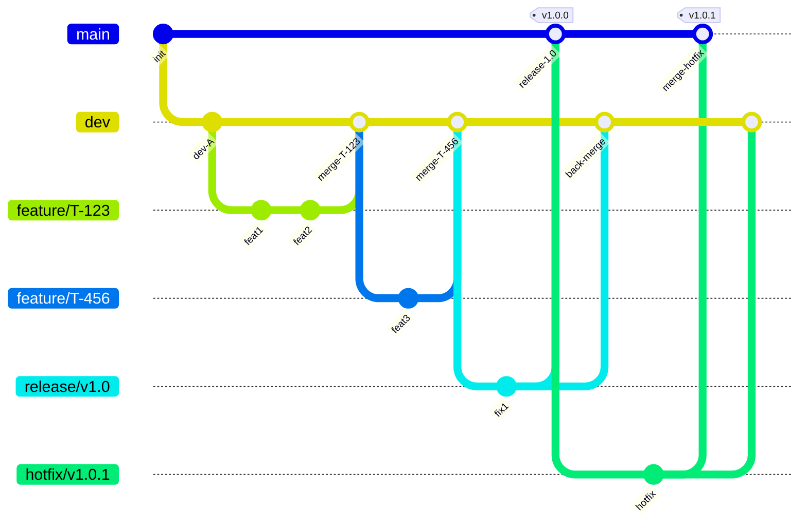

# Branch Strategy (GitFlow) — Team Workflow

This guide explains **how we work as a team** using a GitFlow‑inspired branching model. It keeps the history clean, enables parallel work, and ensures that the `main` branch always contains **stable, production‑ready** code.

> TL;DR: Build features from `dev`, open PRs into `dev`, cut `release/*` branches to ship to `main`, and use `hotfix/*` for urgent production fixes.

---

## Primary Branches

* **`main`**: Production state. Everything in `main` is deployable. Only merges from `release/*` or `hotfix/*` reach `main`.
* **`dev`**: Integration branch for the next version. All feature branches start from and merge back into `dev`.

> Protect `main` from direct pushes and require PR reviews / passing checks. (See “Branch Protection” below.)

---

## Supporting Branches

Temporary branches that facilitate parallel development and releases:

### `feature/*`

* **Purpose**: New features or changes.
* **Create from**: `dev`.
* **Merge into**: `dev`.
* **Naming**: `<trello-id>-<short-desc>`

  * Example: `123-login-with-google`.

### `release/*`

* **Purpose**: Prepare a release (final QA/UAT, small bugfixes, release notes).
* **Create from**: `dev`.
* **Merge into**: `main` **and** `dev`.
* **Naming**: `release/v<version>`

  * Example: `release/v1.2.0`.

### `hotfix/*`

* **Purpose**: Patch a critical production bug ASAP.
* **Create from**: `main`.
* **Merge into**: `main` **and** `dev`.
* **Naming**: `hotfix/v<version>`

  * Example: `hotfix/v1.2.1`.

---

## Daily Flow (Feature Development)

1. **Sync `dev`**

```bash
git checkout dev
git pull origin dev
```

2. **Create a feature branch**

```bash
git checkout -b 123-my-feature dev
```

3. **Commit as you go (Conventional Commits)**

```bash
git add .
git commit -m "feat(auth): add Google login button"
```

4. **Push the branch**

```bash
git push -u origin 123-my-feature
```

5. **Open a Pull Request** from `feature/*` → `dev`.
6. **After approval & green checks**, merge the PR and delete the feature branch.

---

## Release Process

1. **Cut a release branch** when `dev` is ready to ship:

```bash
git checkout -b release/v1.2.0 dev
```

2. **Stabilize**: Only bug fixes, docs, and meta (no new features). Run QA/UAT.
3. **Merge into `main`** when approved:

```bash
git checkout main
git merge --no-ff release/v1.2.0
git push
```

4. **Tag the release** (SemVer):

```bash
git tag -a v1.2.0 -m "Release v1.2.0"
git push --tags
```

5. **Back‑merge into `dev`** to keep it updated:

```bash
git checkout dev
git merge --no-ff release/v1.2.0
git push
```

6. **Delete** `release/*` once completed.

---

## Hotfix Process (Production Patch)

1. **Create hotfix branch** from `main`:

```bash
git checkout main
git pull origin main
git checkout -b hotfix/v1.2.1
```

2. Fix, commit, and **merge to `main`**:

```bash
git commit -m "fix(payments): correct rounding in MXN totals"
git checkout main
git merge --no-ff hotfix/v1.2.1
git push
```

3. **Tag** the hotfix and **back‑merge to `dev`**:

```bash
git tag -a v1.2.1 -m "Hotfix v1.2.1"
git push --tags

git checkout dev
git merge --no-ff hotfix/v1.2.1
git push
```

4. **Delete** `hotfix/*` when done.

---

## Branch Protection (recommended)

**Settings → Branches → Add rule → `main`**

* Require a pull request before merging (≥1 approval, resolve conversations)
* Require status checks to pass (tests, lint, build)
* Require branches to be up to date before merging
* Require linear history (or disable merge commits globally)
* Do not allow force pushes or deletions
* (Optional) Require signed commits
* (Optional) Restrict who can push (keeps direct pushes blocked)

**Optional rule for `dev`**: disallow force pushes/deletions; optionally require checks.

---

## Pull Request Checklist (what reviewers expect)

* Meaningful title using Conventional Commits (`feat:`, `fix:`, `docs:`, `refactor:` …)
* Clear description (What/Why), linked issue/Trello card
* Tests updated/added and passing; lint passes (`ruff format .`, etc.)
* No secrets/keys committed; configs documented
* Screenshots or logs for UI/bug fixes
* Release notes entry if applicable

Create `.github/PULL_REQUEST_TEMPLATE.md`:

```markdown
## Summary
- What changed and why

## Testing
- Steps / results / screenshots

## Checklist
- [ ] Tests pass  
- [ ] Lint passes  
- [ ] Linked issue/Trello  
- [ ] Docs/notes updated
```

---

## Commit Messages & Versioning

* **Conventional Commits**: `type(scope): summary`
  Examples: `feat(api): add seat power endpoint`, `fix(ui): prevent double submit`
* **Types**: `feat`, `fix`, `docs`, `refactor`, `test`, `build`, `ci`, `chore`, `perf` …
* **Semantic Versioning** (SemVer): `MAJOR.MINOR.PATCH`

  * `feat` → usually minor bump
  * `fix` → patch bump
  * breaking changes → major bump (use `!` or `BREAKING CHANGE:` footer)

---

## Naming Conventions

* **Features**: `<id>-<kebab-case-desc>` → `123-login-with-google`
* **Releases**: `release/vX.Y.Z` → `release/v1.2.0`
* **Hotfixes**: `hotfix/vX.Y.Z` → `hotfix/v1.2.1`
* **Tags**: `vX.Y.Z` → `v1.2.0`

---

## Diagram



---

## FAQs

* **Can I push directly to `main`?** No. Open a PR; `main` is protected.
* **When do we cut a `release/*`?** When `dev` is feature‑complete for the next version and tests pass.
* **Where do I fix a production bug?** `hotfix/*` from `main`, then back‑merge to `dev`.
* **What about long‑running features?** Use multiple small PRs; feature flags if needed.

---

If you want, I can also add a small **CODEOWNERS** file and a **Branch Protection** checklist to your repo to enforce these rules.
